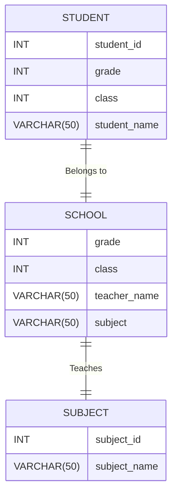

## <p align="center">📆6/3</p>

### 오늘도 RiverPod! Refactoring time

```dart
//before
class MyStateProvider extends StateNotifier<Map<String, String>> {
  MyStateProvider() : super(MyStateProvider(
    // some thing initialize...
  )) {
    initialize();
  }

  Future<void> initialize() async {
     // api...
      state = MyClass.fromJson(result);
  }
}

// parent.dart
ref.watch(MyStateProvider.notifier).initialize();
//부모에서 이렇게 다시 한 번 호출 하고 있었다
```

```dart
//after
class MyStateProvider extends StateNotifier<MyClass> {
  MyStateProvider() : super(MyStateProvider('', '', '')) {
    _initialize();
    //private로 바꿔 내부에서만 사용하게 했다
    //그리고 초기화를 바로 진행하도록 했다.
  }

  Future<void> _initialize() async {
     // api...
      state = MyClass.fromJson(result);
  }
}

//당연히 클래스도 선언을 해야한다!
class MyClass ...
//..data
```

## <p align="center">📆6/16</p>

### copilot + mermaid , erdDiagram



## <p align="center">📆6/18</p>

### 다중 클래스

```python
class Animal:
  def eat(self):
    print('먹다')

class Wing:
  def flap(self):
    print('파닥거리다')  

class Bird(Animal, Wing):

  def fly(self):
    print ('날다')

b = Bird()
b.eat()
b.flap()
b.fly()
print(issubclass(Bird, Animal))
print(issubclass(Bird, Wing))

# 먹다
# 파닥거리다
# 날다
# True
# True
```
- 오답노트:
  - isSubClass는 내장된 함수임
  - 즉 Bird, Wing이 class인가를 확인하는 것